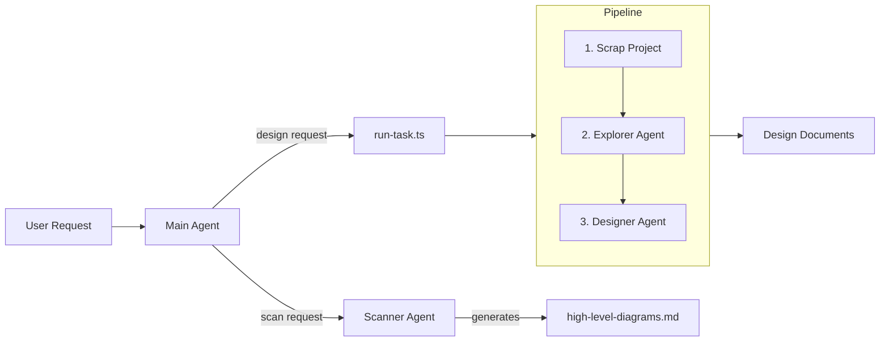

# System Designer

An AI-powered system design automation tool that analyzes your codebase and generates architecture designs.

## What It Does

Given a feature requirement, System Designer:
1. **Scans** your project structure
2. **Explores** relevant code based on your requirement
3. **Generates** system design documents

## How It Works



**Two workflows:**
1. **Scan** (optional) - Generate architecture diagrams before designing
2. **Design** - Run the full pipeline to create system designs

## Setup

### Prerequisites
- Node.js installed
- `openclaw` CLI installed

### Configuration

1. Set your API key:
   ```bash
   export ZAI_API_KEY=your_api_key
   ```

2. Configure project path in `openclaw.json`:
   ```json
   {
     "projectDir": "/path/to/your/project"
   }
   ```

### Directory Structure

```
config/
├── agents/           # Agent configurations
│   ├── main/         # Main agent
│   ├── explore/      # Codebase explorer
│   ├── designer/     # System designer
│   └── scanner/      # Project scanner
├── project-context/  # Generated outputs
└── workspace/        # Working directory
    └── scripts/
        └── run-task.ts
```

## Usage

### Scan Project (Optional)

Ask the Main Agent to scan your codebase first for architecture diagrams:

```bash
openclaw agent --agent main --message "Scan my codebase and generate architecture diagrams"
```

The Main Agent will call the Scanner Agent, which generates `project-context/high-level-diagrams.md`.

### Design System

Send a design request to the Main Agent:

```bash
openclaw agent --agent main --message "Design user authentication with OAuth2"
```

The Main Agent will execute `run-task.ts` which runs the pipeline:
1. Scraps project structure → `project-context/context.md`
2. Explorer analyzes code → updates `context.md`
3. Designer creates design → `project-context/design.md`

## Output

- `project-context/high-level-diagrams.md` - Architecture diagrams (from Scanner Agent)
- `project-context/context.md` - Project structure and analysis (temporary)
- `project-context/design.md` - System design document
