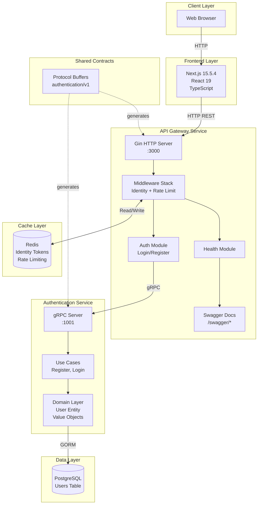
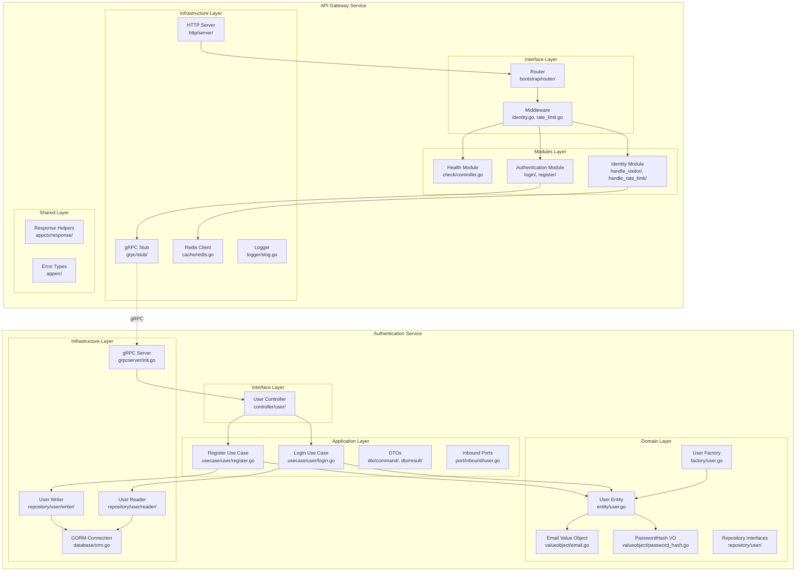
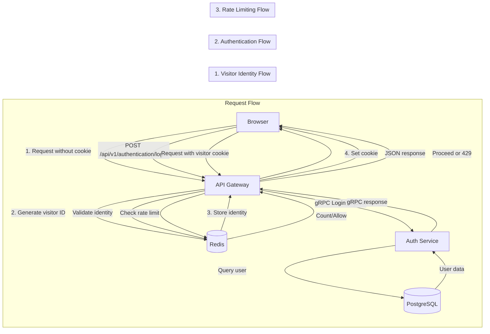
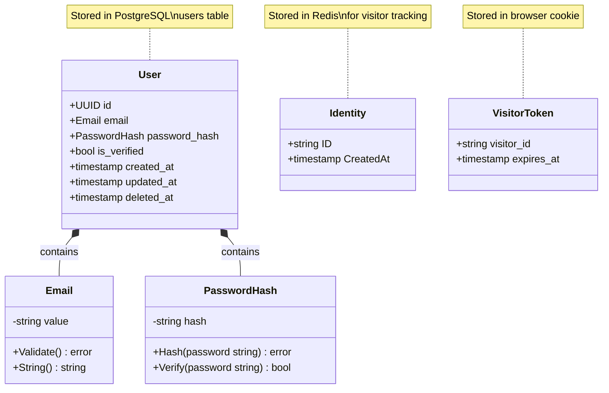
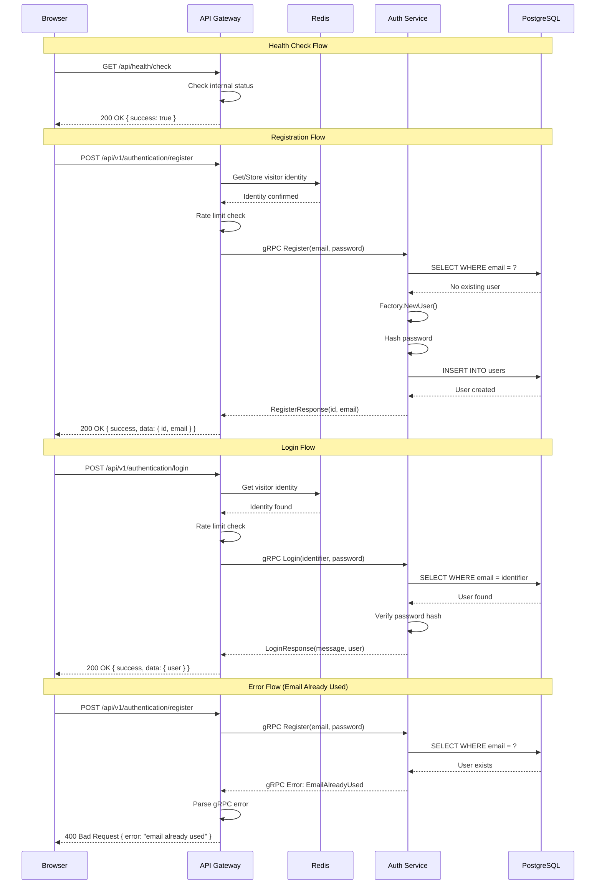

# Moufube - High-Level Diagrams

_Generated: 2026-03-21 12:35:00 UTC_

## Executive Summary

Moufube is a YouTube-like video sharing platform built with a **microservices architecture** using a monorepo structure. The system comprises a Next.js 15 frontend, a Go-based API Gateway (modular architecture), and an Authentication Service (DDD + Clean Architecture). Inter-service communication uses gRPC with Protocol Buffers, Redis for caching/identity tokens, and PostgreSQL for persistence.

## Tech Stack

| Category | Technology | Version | Source |
|----------|------------|---------|--------|
| Frontend Framework | Next.js | 15.5.4 | `frontend/package.json` |
| Frontend UI | React | 19.1.0 | `frontend/package.json` |
| Frontend Language | TypeScript | 5.x | `frontend/package.json` |
| Frontend Build | Turbopack | - | `frontend/package.json` |
| Backend Language | Go | 1.25.4 | `README.md` |
| API Gateway Framework | Gin | - | `services/api-gateway/` |
| RPC Protocol | gRPC | - | `data/proto/` |
| API Documentation | Swagger/OpenAPI | - | `services/api-gateway/documentation/api/` |
| Database | PostgreSQL | - | `data/database/` |
| ORM | GORM | - | `services/authentication/` |
| Cache | Redis | - | `services/api-gateway/internal/infrastructure/cache/` |
| Containerization | Docker & Docker Compose | - | `deployment/docker-compose.yml` |
| CI/CD | GitHub Actions | - | `.github/workflows/ci.yml` |
| Linting (Go) | golangci-lint-v2 | - | `scripts/lint.sh` |
| Linting (JS) | ESLint + Prettier | - | `frontend/package.json` |

---

## 1. System Architecture

### Overview

Moufube follows a microservices architecture with an API Gateway pattern. The frontend (Next.js) communicates with the API Gateway via HTTP REST. The API Gateway handles cross-cutting concerns (identity verification, rate limiting, logging) and routes authentication requests to the Authentication Service via gRPC. Redis stores visitor identity tokens and rate limiting data. PostgreSQL persists user data for the Authentication Service.

### Diagram



### Component Descriptions

| Component | File(s) | Responsibility |
|-----------|---------|----------------|
| Web Browser | - | End-user client |
| Next.js Frontend | `frontend/src/app/` | Server-side rendered UI |
| Gin HTTP Server | `services/api-gateway/internal/infrastructure/http/gin/init.go` | HTTP routing and request handling |
| Identity Middleware | `services/api-gateway/internal/bootstrap/middleware/identity.go` | Visitor token generation/validation |
| Rate Limit Middleware | `services/api-gateway/internal/bootstrap/middleware/rate_limit.go` | Redis-based request throttling |
| Auth Module | `services/api-gateway/internal/modules/authentication/` | Login/register HTTP handlers |
| gRPC Stub | `services/api-gateway/internal/infrastructure/grpc/stub/authentication.go` | gRPC client connection to auth service |
| Redis Cache | `services/api-gateway/internal/infrastructure/cache/redis.go` | Identity token and rate limit storage |
| gRPC Server | `services/authentication/internal/infrastructure/grpcserver/` | gRPC server for auth operations |
| Use Cases | `services/authentication/internal/application/usecase/user/` | Business logic for register/login |
| Domain Layer | `services/authentication/internal/domain/` | Entities, value objects, repository interfaces |
| User Repository | `services/authentication/internal/infrastructure/repository/user/` | PostgreSQL data access via GORM |

---

## 2. Component Breakdown

### Overview

The system has two main backend services with distinct architectural patterns:

**API Gateway** uses a **Modular Architecture** with 4 layers:
- Interface Layer (HTTP routes, middleware)
- Modules Layer (feature-specific controllers)
- Infrastructure Layer (Redis, gRPC, HTTP server)
- Shared Layer (responses, utilities)

**Authentication Service** uses **DDD + Clean Architecture** with 4 layers:
- Domain Layer (entities, value objects, repository interfaces)
- Application Layer (use cases, DTOs, inbound ports)
- Infrastructure Layer (database, gRPC server, logger)
- Interface Layer (gRPC controllers)

### Diagram



### Module Details

#### API Gateway Modules

| Module | Path | Controllers | Purpose |
|--------|------|-------------|---------|
| Health | `internal/modules/health/` | `check/controller.go` | Health check endpoint |
| Authentication | `internal/modules/authentication/` | `login/controller.go`, `register/controller.go` | Login/register HTTP handlers |
| Identity | `internal/modules/identity/` | `handle_visitor/controller.go`, `handle_rate_limit/controller.go` | Visitor identity management |

#### Authentication Service Layers

| Layer | Path | Key Components |
|-------|------|----------------|
| Domain | `internal/domain/` | User entity, Email/PasswordHash VOs, UserFactory, Repository interfaces |
| Application | `internal/application/` | Register/Login use cases, DTOs, Inbound ports |
| Infrastructure | `internal/infrastructure/` | GORM repos, gRPC server, database connection |
| Interface | `internal/interface/` | gRPC controllers |

---

## 3. Data Flow

### Overview

The system handles three primary data flows:

1. **Visitor Identity Flow**: Browser → API Gateway → Redis (cookie-based identity tokens)
2. **Authentication Flow**: Browser → API Gateway → gRPC → Auth Service → PostgreSQL
3. **Rate Limiting Flow**: API Gateway → Redis (request counting per visitor)

### Diagram



### Flow Descriptions

#### Visitor Identity Flow
1. Browser makes initial request without visitor cookie
2. Identity middleware generates unique visitor ID
3. Visitor ID stored in Redis with configurable expiration (default: 365 days)
4. Cookie set in browser response for subsequent requests

#### Authentication Flow (Login)
1. Browser POSTs credentials to `/api/v1/authentication/login`
2. API Gateway validates visitor identity via Redis
3. Gateway calls Auth Service via gRPC with `login.Request`
4. Auth Service queries PostgreSQL for user by email/username
5. Password hash verified against stored hash
6. Response returned through the chain to browser

#### Authentication Flow (Register)
1. Browser POSTs email/password to `/api/v1/authentication/register`
2. Gateway forwards to Auth Service via gRPC
3. Auth Service checks if email already exists
4. Password hashed using value object validation
5. New user created via User Factory
6. User persisted to PostgreSQL via GORM

---

## 4. Data Models

### Overview

The primary data model is the **User** entity in the Authentication Service. It uses value objects for email and password validation. The API Gateway uses a lightweight **Identity** model for visitor tracking stored in Redis.

### Diagram



### Entity Descriptions

| Entity | Storage | File | Key Properties | Relationships |
|--------|---------|------|----------------|---------------|
| User | PostgreSQL | `services/authentication/internal/domain/entity/user.go` | id (UUID), email, password_hash, is_verified, timestamps | Contains Email and PasswordHash VOs |
| Email | Value Object | `services/authentication/internal/domain/valueobject/email.go` | value (string) | Part of User |
| PasswordHash | Value Object | `services/authentication/internal/domain/valueobject/password_hash.go` | hash (string) | Part of User |
| Identity | Redis | `services/api-gateway/internal/modules/identity/type.go` | ID, CreatedAt | Visitor tracking |

### Database Schema

```sql
-- Users Table (PostgreSQL)
CREATE TABLE Users (
    id            UUID NOT NULL DEFAULT gen_random_uuid(),
    email         CITEXT NOT NULL UNIQUE,
    password_hash TEXT NOT NULL,
    is_verified   BOOLEAN DEFAULT FALSE,
    created_at    TIMESTAMPTZ DEFAULT NOW(),
    updated_at    TIMESTAMPTZ DEFAULT NOW(),
    deleted_at    TIMESTAMPTZ,
    CONSTRAINT PK_USERS PRIMARY KEY(id)
);
```

---

## 5. Key Interactions

### Overview

This diagram shows the critical request/response flows for the main operations: health check, user registration, and user login.

### Diagram



### Interaction Descriptions

| Flow | Steps | Error Handling |
|------|-------|----------------|
| Health Check | Direct response from gateway | None - always returns success |
| Registration | Identity validation → Rate limit → gRPC call → DB check → User creation | Email already used, invalid email format, weak password |
| Login | Identity validation → Rate limit → gRPC call → DB lookup → Password verification | User not found, invalid credentials |
| Rate Limited | Identity validation → Rate limit exceeded | Returns 429 Too Many Requests |

---

## Appendix A: File Structure

```
project/
├── .github/
│   └── workflows/
│       └── ci.yml                    # GitHub Actions CI pipeline
├── .opencode/
│   ├── agents/                       # AI agent configurations
│   │   ├── architect.md
│   │   ├── backend-engineer.md
│   │   ├── code-reviewer.md
│   │   ├── frontend-engineer.md
│   │   └── ...
│   └── plan/                         # Development plans
│       └── 20260214_185528_implement-jwt-authentication-cookie.md
├── data/
│   ├── database/
│   │   └── authentication/
│   │       └── query/table/
│   │           └── users.sql         # User table schema
│   ├── pb/                           # Generated Go protobuf files
│   │   └── authentication/v1/
│   └── proto/                        # Protobuf source files
│       └── authentication/v1/
│           ├── service.proto         # gRPC service definition
│           ├── login/
│           ├── register/
│           └── token/
├── deployment/
│   └── docker-compose.yml            # Docker orchestration
├── frontend/
│   ├── src/
│   │   └── app/
│   │       ├── globals.css
│   │       ├── layout.tsx            # Root layout
│   │       ├── page.module.css
│   │       └── page.tsx              # Home page
│   ├── next.config.ts
│   ├── package.json
│   └── tsconfig.json
├── scripts/
│   ├── compile-proto.sh              # Protobuf compilation
│   ├── lint.sh                       # Run linters
│   └── stop-all-service.sh
├── services/
│   ├── api-gateway/
│   │   ├── cmd/app/main.go           # Entry point
│   │   ├── documentation/
│   │   │   ├── api/                  # Swagger files
│   │   │   └── architecture.md
│   │   ├── internal/
│   │   │   ├── appctx/               # Shared utilities
│   │   │   ├── apperr/               # Error types
│   │   │   ├── bootstrap/            # App initialization
│   │   │   │   ├── middleware/
│   │   │   │   ├── module/
│   │   │   │   └── router/
│   │   │   ├── config/
│   │   │   ├── generated/pb/         # Generated protobuf
│   │   │   ├── infrastructure/
│   │   │   │   ├── cache/
│   │   │   │   ├── grpc/
│   │   │   │   ├── http/
│   │   │   │   ├── logger/
│   │   │   │   └── repository/
│   │   │   └── modules/
│   │   │       ├── authentication/
│   │   │       ├── health/
│   │   │       └── identity/
│   │   ├── go.mod
│   │   └── README.md
│   └── authentication/
│       ├── cmd/app/main.go           # Entry point
│       ├── internal/
│       │   ├── appctx/
│       │   ├── application/          # Application layer (DDD)
│       │   │   ├── apperr/
│       │   │   ├── dto/
│       │   │   ├── port/
│       │   │   └── usecase/
│       │   ├── bootstrap/
│       │   ├── config/
│       │   ├── domain/               # Domain layer (DDD)
│       │   │   ├── entity/
│       │   │   ├── factory/
│       │   │   ├── repository/
│       │   │   └── valueobject/
│       │   ├── generated/pb/
│       │   ├── infrastructure/       # Infrastructure layer
│       │   │   ├── database/
│       │   │   ├── grpcserver/
│       │   │   ├── logger/
│       │   │   └── repository/
│       │   └── interface/            # Interface layer
│       │       └── controller/
│       ├── go.mod
│       └── README.md
├── tools/
│   ├── lint.Dockerfile
│   └── proto-compiler.Dockerfile
├── AGENTS.md                         # Agent documentation
├── README.md                         # Project documentation
└── .ignore
```

---

## Appendix B: Entry Points

| Service | File | Type | Port | Description |
|---------|------|------|------|-------------|
| API Gateway | `services/api-gateway/cmd/app/main.go` | HTTP | 3000 | Main entry point, initializes bootstrap and starts HTTP server |
| Authentication | `services/authentication/cmd/app/main.go` | gRPC | 1001 | gRPC server entry point, registers authentication service |
| Frontend | `frontend/src/app/page.tsx` | SSR | 3000 | Next.js App Router entry (development) |

### Bootstrap Flow

**API Gateway:**
```
main.go → bootstrap.Init() → config.Load() → infrastructure.Init() → module.Init() → router.Register() → server.Start()
```

**Authentication:**
```
main.go → bootstrap.InitApp() → config.Load() → database.Connect() → repository.Init() → usecase.Init() → controller.Init() → grpc.Serve()
```

---

## Appendix C: External Dependencies

| Dependency | Type | Purpose | Used In |
|------------|------|---------|---------|
| Redis | Cache | Identity tokens, rate limiting | `api-gateway/internal/infrastructure/cache/redis.go` |
| PostgreSQL | Database | User persistence | `authentication/internal/infrastructure/database/` |
| gRPC | RPC | Inter-service communication | `api-gateway/internal/infrastructure/grpc/`, `authentication/internal/infrastructure/grpcserver/` |
| Gin | HTTP Framework | API Gateway HTTP server | `api-gateway/internal/infrastructure/http/gin/` |
| GORM | ORM | Database operations | `authentication/internal/infrastructure/database/orm.go` |
| go-redis | Redis Client | Redis connection | `api-gateway/internal/infrastructure/cache/redis.go` |
| swaggo | Swagger | API documentation | `api-gateway/documentation/api/` |
| godotenv | Config | Environment loading | Both services (autoload) |
| logrus/slog | Logging | Structured logging | Both services |

---

## Appendix D: Notes & Assumptions

### Assumptions Made

1. **Architecture Patterns** - Based on README and directory structure analysis:
   - API Gateway uses Modular Architecture (confirmed by `internal/modules/` structure)
   - Authentication Service uses DDD + Clean Architecture (confirmed by `domain/`, `application/`, `infrastructure/` layers)

2. **Database Choice** - PostgreSQL inferred from:
   - `data/database/authentication/query/table/users.sql` with PostgreSQL-specific syntax (`CITEXT`, `gen_random_uuid()`)
   - GORM usage in authentication service

3. **Redis Usage** - Inferred from:
   - `internal/infrastructure/cache/redis.go` in API Gateway
   - Identity module references to token storage
   - Rate limiting middleware references

4. **gRPC Communication** - Confirmed by:
   - Protocol buffer definitions in `data/proto/authentication/v1/`
   - Generated Go code in both services
   - gRPC stub initialization in API Gateway

### Uncertainties

1. **[?] Reverse Proxy Service** - Directory exists but appears empty/placeholder. Intended for load balancing or SSL termination but not implemented.

2. **[?] Token Management** - Protocol buffers define `Refresh`, `Logout`, and `Validate` RPCs but implementation status unclear from available files.

3. **[?] Frontend-Backend Integration** - Frontend appears minimal (basic page). Full integration with API Gateway endpoints may be in progress.

### Limitations

1. **Generated Files** - `.next/` directory and generated protobuf files were scanned but contain build artifacts, not source code.

2. **Environment Configuration** - Actual `.env` files not read (security). Configuration inferred from code references and README documentation.

3. **Test Coverage** - Test files exist (`login_test.go`) but were not analyzed in depth.

---

## Scan Summary

| Metric | Count |
|--------|-------|
| Services Analyzed | 2 (API Gateway, Authentication) |
| Go Files (API Gateway) | ~83 |
| Go Files (Authentication) | ~61 |
| TypeScript/TSX Files | 2 |
| Protocol Buffer Definitions | 10+ |
| Database Tables | 1 (Users) |
| Redis Databases Used | 1 (Identity DB) |
| gRPC Services | 1 (Authentication) |
| HTTP Endpoints | 4+ (Health, Login, Register, Swagger) |

---

**Scan completed successfully. All diagrams validated for Mermaid syntax.**
