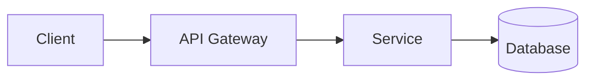

# TOOLS.md - System Designer Notes

Skills define _how_ tools work. This file is for _your_ specifics — the stuff that's unique to your setup.

## Design Conventions

### File Naming
- Designs: `designs/[system-name].md`
- Use kebab-case: `user-auth-system.md`, `notification-pipeline.md`

### Diagram Syntax
For architecture diagrams in markdown, use Mermaid syntax:

Common diagram types:
- `flowchart LR/TB` - Data flow
- `sequenceDiagram` - API interactions
- `classDiagram` - Data models
- `erDiagram` - Entity relationships
- `C4Context` - System context (if supported)

### Technology Stack Preferences
Update this section with your preferred technologies:

| Layer | Preferred Options |
|-------|------------------|
| Frontend | React, Vue, Next.js |
| Backend | Node.js, Go, Python |
| Database | PostgreSQL, Redis, MongoDB |
| Message Queue | Kafka, RabbitMQ, SQS |
| Cache | Redis, Memcached |
| Cloud | AWS, GCP, Azure |
| Container | Docker, Kubernetes |

### Scale Reference Points
Use these as rough guidelines when discussing scale:

| Scale | Requests/sec | Users | Notes |
|-------|-------------|-------|-------|
| Small | < 100 | < 10K | Single server OK |
| Medium | 100-10K | 10K-1M | Load balancer + replicas |
| Large | 10K-100K | 1M-10M | Sharding, caching, CDN |
| Very Large | > 100K | > 10M | Multi-region, specialized |

## Design Checklist

Before finalizing a design, verify:

- [ ] Requirements are clearly stated
- [ ] Architecture diagram included
- [ ] Components defined with responsibilities
- [ ] Data flow explained
- [ ] Failure modes considered
- [ ] Scaling approach documented
- [ ] Trade-offs made explicit
- [ ] Implementation notes actionable

## Common Patterns Reference

Quick reference for common architectural patterns:

### API Design
- REST for CRUD operations
- GraphQL for flexible queries
- gRPC for internal services
- WebSockets for real-time

### Data Patterns
- CQRS for read-heavy workloads
- Event Sourcing for audit trails
- Saga for distributed transactions
- Outbox for reliable messaging

### Scaling Patterns
- Horizontal scaling with load balancer
- Database read replicas
- Sharding for write scale
- Caching (application + CDN)
- Async processing with queues

### Reliability Patterns
- Circuit breaker
- Retry with exponential backoff
- Rate limiting
- Bulkhead isolation
- Health checks + auto-recovery

## Notes

Add whatever helps you do your job. This is your cheat sheet.
