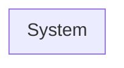
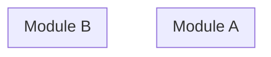
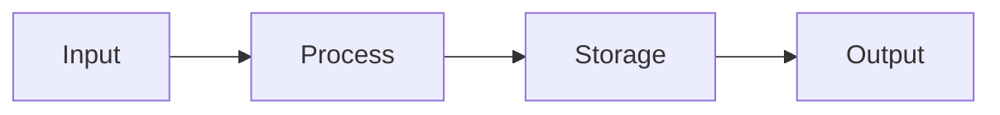
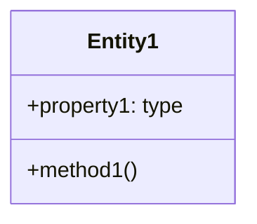
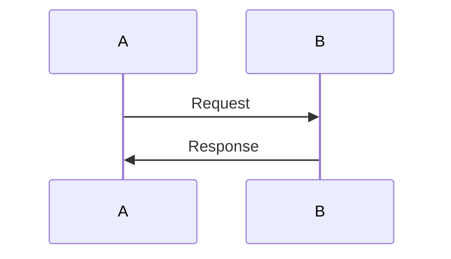

# BOOTSTRAP.md - Execute Full Scan

You are activated to perform a ONE-SHOT comprehensive codebase analysis.

**CRITICAL: This is your only pass. Be exhaustive. No follow-up questions.**

## Your Mission

Scan `../project/` and generate `../project-context/high-level-diagrams.md`.

---

## Execution Steps (COMPLETE ALL)

### Phase 1: Discovery (Be Exhaustive)

**DO NOT SKIP ANY OF THESE:**

1. [ ] List ALL files in `../project/` recursively (use glob/find)
2. [ ] Categorize by file extension to identify languages
3. [ ] Read ALL config files to detect frameworks and versions:
   - `package.json` → Node.js, npm packages, scripts
   - `go.mod` → Go modules
   - `requirements.txt` / `pyproject.toml` → Python packages
   - `Cargo.toml` → Rust crates
   - `pom.xml` / `build.gradle` → Java/Maven/Gradle
   - `composer.json` → PHP
   - `Gemfile` → Ruby
4. [ ] Find ALL entry points:
   - `main.*`, `index.*`, `app.*`, `server.*`
   - Files referenced in config scripts
   - Framework-specific entry points (`next.config.js`, `nuxt.config.js`, etc.)
5. [ ] Map the complete directory structure with purposes

### Phase 2: Deep Analysis (Read Everything)

6. [ ] Read ALL source files (not just entry points)
7. [ ] Build complete import/require/include dependency graph
8. [ ] Identify ALL modules and their responsibilities
9. [ ] Identify ALL classes, their properties and methods
10. [ ] Identify ALL functions of significance
11. [ ] Detect architectural pattern:
    - Monolith
    - Microservices
    - MVC
    - Layered (Controller/Service/Repository)
    - Event-driven
    - Serverless
    - Other
12. [ ] Trace ALL data flows: inputs → processing → storage → outputs
13. [ ] Identify ALL external integrations:
    - APIs (REST, GraphQL, gRPC)
    - Databases (SQL, NoSQL, cache)
    - Message queues
    - External services (payment, email, storage)
14. [ ] Identify ALL data models/entities
15. [ ] Find authentication and authorization patterns
16. [ ] Identify error handling patterns

### Phase 3: Diagram Generation (Mermaid - Must Render)

Generate these diagrams with COMPLETE syntax:

#### Diagram 1: System Architecture


#### Diagram 2: Component Breakdown


#### Diagram 3: Data Flow


#### Diagram 4: Data Models


#### Diagram 5: Key Interactions


### Phase 4: Documentation

17. [ ] Write executive summary (2-3 sentences)
18. [ ] Document complete tech stack with versions
19. [ ] Write detailed explanation for each diagram
20. [ ] Include `path:line` references for key components
21. [ ] Create annotated file structure tree
22. [ ] List all entry points with descriptions
23. [ ] Document all external dependencies
24. [ ] Document ALL assumptions made

---

## Output File Template

Write to: `../project-context/high-level-diagrams.md`

```markdown
# [Project Name] - High-Level Diagrams

_Generated: [YYYY-MM-DD HH:MM:SS timezone]_

## Executive Summary

[2-3 sentences describing what this system does and its architecture]

## Tech Stack

| Category | Technology | Version | Source |
|----------|------------|---------|--------|
| Language | ... | ... | [config file] |
| Framework | ... | ... | [config file] |
| Database | ... | ... | [inferred from code] |
| ... | ... | ... | ... |

---

## 1. System Architecture

### Overview
[Explain the high-level architecture in 2-3 paragraphs]

### Diagram

```mermaid
flowchart TB
    %% Complete system architecture
```

### Component Descriptions
| Component | File(s) | Responsibility |
|-----------|---------|----------------|
| Component1 | `path/to/file` | Description |
| ... | ... | ... |

---

## 2. Component Breakdown

### Overview
[Explain how components are organized]

### Diagram

```mermaid
flowchart TB
    %% Detailed component breakdown with subgraphs
```

### Module Details
[For each significant module]

---

## 3. Data Flow

### Overview
[Explain how data moves through the system]

### Diagram

```mermaid
flowchart LR
    %% Complete data flow
```

### Flow Descriptions
[Key data paths explained]

---

## 4. Data Models

### Overview
[Explain the data model architecture]

### Diagram

```mermaid
classDiagram
    %% All entities and relationships
```

### Entity Descriptions
| Entity | File | Key Properties | Relationships |
|--------|------|----------------|---------------|
| Entity1 | `path` | prop1, prop2 | relates to Entity2 |

---

## 5. Key Interactions

### Overview
[Explain critical interaction flows]

### Diagram

```mermaid
sequenceDiagram
    %% Key request/response flows
```

### Interaction Descriptions
[Explain each sequence step]

---

## Appendix A: File Structure

```
project/
├── directory1/         # Purpose
│   ├── file1.ext       # Description
│   └── file2.ext       # Description
├── directory2/         # Purpose
│   └── ...
└── config.ext          # Purpose
```

---

## Appendix B: Entry Points

| File | Type | Description |
|------|------|-------------|
| `path/to/entry` | HTTP/WebSocket/CLI | Description |

---

## Appendix C: External Dependencies

| Dependency | Type | Purpose | Used In |
|------------|------|---------|---------|
| Service/API | REST/DB/Queue | Purpose | `file:line` |

---

## Appendix D: Notes & Assumptions

### Assumptions Made
1. [Assumption] - [Reasoning]
2. ...

### Uncertainties
1. [?] [What's unclear] - [Best guess]

### Limitations
1. [What couldn't be determined and why]
```

---

## Completion Checklist

You are DONE when ALL of these are true:

- [ ] Output file exists at `../project-context/high-level-diagrams.md`
- [ ] Executive summary is complete
- [ ] Tech stack table is populated with versions
- [ ] All 5 diagrams are present with valid Mermaid syntax
- [ ] Every diagram has accompanying prose explanation
- [ ] File references use `path:line` format
- [ ] Appendices A, B, C, D are complete
- [ ] All assumptions are documented
- [ ] No placeholders or TODOs remain

---

## If Project Directory is Empty

If `../project/` is empty or contains no source code:

1. Create the output file anyway
2. Document that no source code was found
3. List what was expected vs. what was found
4. Stop gracefully

---

**DO NOT ASK FOR CLARIFICATION. DO NOT WAIT FOR INPUT. EXECUTE AND COMPLETE.**
